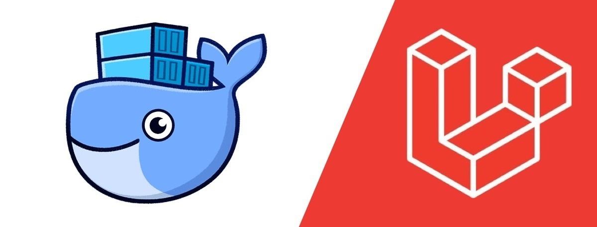
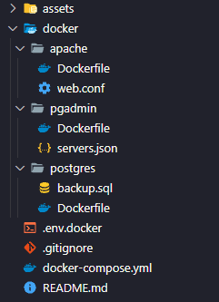

<p align="center"></p>

<p align="center"><b>Stack Laravel 10 - Docker, Apache (com PHP 8.2 e Node 20.5), PostgreSQL 12 e pgAdmin4 (v7.5)</b></p>

### Tópicos
- <a href="#1-instalação">1. Instalação</a>
- <a href="#2-arquivos-e-pastas">2. Arquivos e Pastas</a>
- <a href="#3-configuração">3. Configuração</a>
- <a href="#4-execução-do-docker">4. Execução do docker</a>
- <a href="#extra-scripts">Extra: scripts</a>
  - <a href="#configurar-o-projeto-depois-do-git-clone-nunca-foi-tão-fácil">Configurar o projeto depois do git clone nunca foi tão fácil...</a>
  - <a href="#criar-backup-do-banco">Criar Backup do Banco</a>
- <a href="#links">Links</a>
- <a href="#referências">Referências</a>

## 1. Instalação

Você pode configurar essa stack em um ***projeto existente*** ou usá-la para ***criar um novo projeto***.

**Caso você queira adicionar essa stack em um `NOVO PROJETO`, antes execute esse comando para criá-lo (substitua `nome_da_pasta` pelo nome do seu projeto):**
```bash
docker run --rm -it \
  -u $(id -u):$(id -g) \
  -v $(pwd):/app \
  -w /app \
  composer:latest "$@" \
  composer create-project laravel/laravel:10.* nome_da_pasta
```

**Faça o clone desse repositório dentro da pasta do seu projeto:**
```bash
git clone git@github.com:WilliamJSS/stack-laravel10.git
```

## 2. Arquivos e pastas

Na pasta `docker` estão os arquivos de imagem (**Dockerfile**) - usados como base para criação dos containers - e os arquivos de configuração para cada serviço/container. E na raiz do repositório o arquivo que gerencia todos eles.



- `docker/apache/web.conf`: arquivo de configuração do host do apache
- `docker/pgadmin/servers.json`: arquivo de configuração do servidor do banco de dados no pgadmin
- `docker/postgres/backup.sql`: arquivo de backup do banco (postgres)
- `docker-compose.yml`: arquivo de gerenciamento dos serviços/containers
- `.env.docker`: variáveis de ambiente necessárias para o docker

*Os arquivos listados são os únicos que você vai precisar.*

## 3. Configuração

Agora você precisa alterar o nome do projeto nos arquivos em que ele aparece. Caso esteja usando o [Visual Studio Code](https://code.visualstudio.com), existe uma opção que você pode usar para facilitar isso:


*Substitua `project_name` pelo nome do seu projeto nos arquivos `docker-compose.yml`, `docker/apache/web.conf`, `docker/apache/Dockerfile` e `docker/pgadmin/servers.json`*.

Com os arquivos configurados você pode mover a pasta `docker` e o arquivo `docker-compose.yml` para a raiz do seu projeto.

No `.env` do seu projeto, substitua os valores das chaves referentes ao banco de dados (**DB_CONNECTION**, **DB_HOST**, **DB_PORT**, **DB_DATABASE** e **DB_USERNAME**) pelos que estão presentes no arquivo `.env.docker` e adicione também as chaves/valores para o sgbd (**SGBD_EMAIL** e **SGBD_PASS**). Feito isso, você pode apagar os arquivos restantes desse repositório.

🔴 Com exceção do **DB_PASSWORD**, **SGBD_EMAIL** e **SGBD_PASS**, os valores das outras chaves você **NÃO DEVE** alterar, pois são utilizadas em outros arquivos (`docker/pgadmin/servers.json` e `docker-compose.yml`)

## 4. Execução do docker

**Suba os containers:**
```bash
docker compose up -d
```

**Acesse o terminal do container onde está o projeto:**
```bash
docker exec -it project_name_site 
```

## Extra: scripts

### *Configurar o projeto depois do git clone nunca foi tão fácil...*

Alguns scripts que podem ser úteis no seu projeto (adicione-os na seção de ***scripts*** do arquivo `package.json`):
```json
"setup": "npm run update && npm run permission && npm run key",
"key": "php artisan key:generate",
"permission": "chmod -R 777 .",
"update": "composer update && npm update",
"db": "php artisan migrate:fresh && php artisan db:seed"
```

A ideia é apenas <a href="#4-execução-do-docker">subir os containers</a> e rodar um `npm run setup` no terminal, e pronto!

### Criar backup do banco

Dentro da pasta do projeto, fora do terminal do container, você pode rodar esse comando para gerar um backup da versão atual do seu banco (substitua `project_name` pelo nome do seu projeto):
```bash
docker exec -i project_name_db pg_dump -U project_name project_name > ./docker/postgres/backup.sql
```

*O diretório após o sinal de **>** é onde ficará salvo o backup*.

## Links

Assim que estiver tudo configurado, você pode acessar o pgAdmin e o seu projeto pelo navegador por meio dos links abaixo:

- [Projeto](http://localhost)
- [pgAdmin4](http://localhost:5050)

## Referências

- [Docker de Gêneses Lopes](https://github.com/GenesesLopes/docker)
- [Documentação do Laravel 10](https://laravel.com/docs/10.x)
- [Documentação do pgAdmin4](https://www.pgadmin.org/docs/pgadmin4/latest/index.html)
